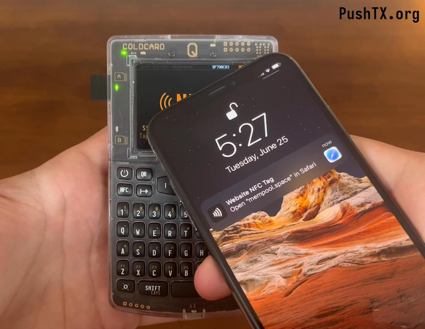

# NFC Push TX -- Coldcard Feature _(new)_



This feature allows single-tap broadcast of freshly-signed transactions from a [COLDCARD](https://coldcard.com).

`PSBT ==[SD|QR|NFC]==> COLDCARD signed TXN ==[NFC tap]==> Phone Browser ==> TXN Broadcast by node`

Once enabled with a URL, the COLDCARD will show the NFC animation
after signing the transaction. When the user taps their phone, the
phone will see an NFC tag with URL inside. That URL contains the
signed transaction ready to go, and once opening in the mobile
browser of the phone, that URL will load. The page will connect to
a Bitcoin node and send the transaction on the public Bitcoin network.

This feature is available on Q and Mk4 and requires NFC to be enabled.
See `Advanced/Tools > NFC Push Tx` to enable.

## URL Protocol Spec

The URL contains the signed transaction in 
[base64url](https://datatracker.ietf.org/doc/html/rfc4648#section-5)
and an truncated SHA-256 checksum.

Read the [full specification here](https://github.com/Coldcard/firmware/blob/master/docs/nfc-pushtx.md).

## Public Services

We know of the following services that your Coldcard can use:

- `mempool.space/pushtx'
- `coldcard.com/pushtx' 
- `pushtx.org/pushtx' 

You can also host your own backend and there may be other services out there
we don't know about.

## Roll Your Own

This [github repo](https://github.com/Coldcard/push-tx) contains the source for
the code hosted at `Coldcard.com/pushtx` for your review or to replace
and personalize. It also is the source for this website (*pushtx.org*).

A single-file (html and javascript) file is available
at [from pushtx.org](cc-implementation/build-single-file/index.html)
or slightly more directly
[from the github repo.](https://github.com/Coldcard/push-tx/blob/master/cc-implementation/build-single-file/index.html)
You can host this file anywhere your phone can reach, and then use that URL in your
COLDCARD settings. It uses your phone's browser to submit 
to `mempool.space` and `blockstream.info` sites (both at same time). It is equivalent
to the page hosted at `https://coldcard.com/pushtx#`

It's not hard to write your own code to submit a signed transaction to your
node directly using the RPC-JSON protocol. For maximum privacy, that would
be best, since there is no need to involve outside services.

### Notes

- Complete URL might be as large as 8,000 bytes. Some web servers will not support beyond
  4k bytes and the NFC implementation of the phone may also have limits. Truncation
  errors will be detected by the checksum.
- The service URL provided must end in `?` or `#` or `&`.
- Honest backends will not log the IP address of incoming transactions, but there is
  no way to enforce that, and CloudFlare sees all.

## Example URL

```
https://mempool.space/pushtx#t=AgAAAAOHqK3w3hC6PSC0buthnJA5R9Y88WAlEvm9cifNVUPhIwAAAABqRzBEAiB-M9YprNYoohqHdQHg4wY_qcEMwDmyIQH8prykk8-0KwIgARxcojKrtixicouiUxhk4jQq_MAl11ptIgHDlRjgk5ABIQM4bgMAVDbDSr_9CvLjbg5nxrWnDGI-kVmkfL81GXZtCf____8OaH0RxW7DjZKdIF6rvbHvvyFGCBQ0PTgpx20nA_wbLgAAAABqRzBEAiBwUFigORJDPK8ptnYPAntjV-RUn1jAuzphicQstwVv-QIgEbMC8FWXQ5Jve5DaAqKJsqoj3peK83iub_oOkmbiYg4BIQO5Ehn2t0oUG3hnK4cBnwCwMc33DcdJ8aSMWzRQ_wjZL_____-UG6M-eBeAun-EZp6EbVypvVJ3mXCQrN_fUDn-kwoEnQAAAABqRzBEAiAgFAtVTpQYTKplc9NuV7Ws7ZFYeNO8BCS4ozgWrgd2ogIgGTTcw98xQdcGWeWQhVfVm_vZorBIOYovQPQeK0Lg9t8BIQLPWPioVWvj1z4NMHBCkeirYOUalCa83wbSH0CREnGZvv____8CjM_wCAAAAAAZdqkUIJA8_yqzaj0NzhvYVEIBno5gETGIrIzP8AgAAAAAGXapFEaV7xTyleuEX9OejdlUlsz7RTr0iKwAAAAA&c=hre47vyMC78&n=XTN
```

- this transaction doesn't have valid inputs, and will cause an error
- mempool.space will redirect this to a testnet endpoint (because ends with `n=XTN`)


